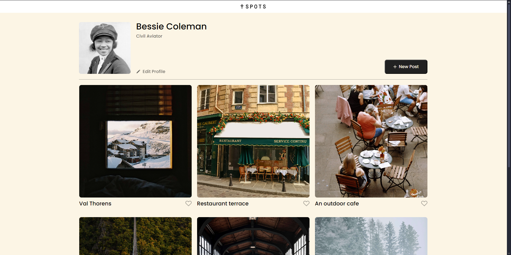

# Spots

An image-sharing website.

## Description

Spots is an open-space platform where users can upload photos that they've taken to a profile they created along with a small description of the image. This profile can then be seen by other users on the platform and can even be interacted with via a like button below the images. Users have the ability to edit the details of their profile and even add a description to the account.

## Tech Tools

- HTML
- CSS
- Responsive design and layout

## Layout Range

Spots has a wide range of device inclusion, from the smallest 320 pixel screens to the biggest 4K screens.

## Deployment

This webpage is deployed to GitHub Pages

- [Deployment Link](https://wildrabbit2004.github.io/se_project_spots/)

- [Presentation Video](https://drive.google.com/file/d/1rKq_mcScxKaIfl5NH_fKNGyw_rgUXghg/view?usp=sharing)
